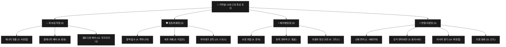
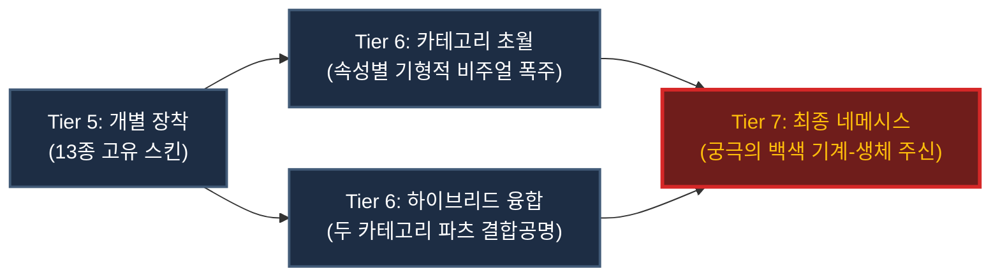

# 🧬 프로젝트 2100 캐릭터 특성 (Traits) & 진화 시스템 마스터 가이드

본 문서는 [game.js](file:///D:/workspace/newfolder/game.js)와 [project_2100_design_spec.md](file:///D:/workspace/newfolder/docs/project_2100_design_spec.md)의 설계를 결합하여, **1~13번 지역의 고유 특성 해금과 4대 카테고리 진화 트리**를 처음부터 완전하게 재정립한 종합 가이드라인입니다.

---

## 1. 캐릭터 진화 및 등급 (Evolution Tier) 시스템

플레이어는 각 대륙 지역을 완파하여 고유 특성을 해금하고, 세포 격리실(거점 안전쉘터)에서 방사능(`Rad`)을 소모해 신체 세포를 진화시킬 수 있습니다. 진화한 특성의 개수와 융합 상태에 따라 캐릭터의 진화 등급(1~7성)이 실시간으로 결정됩니다.

| 진화 등급 (Tier) | 달성 및 진화 조건 | 스펙 특징 |
| :--- | :--- | :--- |
| **Tier 1 (1성)** | 초기 생성 요원 상태 | 기본 생존 능력 및 외형 보유 |
| **Tier 2 (2성)** | 특성 1개 이상 획득 시 | 기본 스탯 가중치 활성화 |
| **Tier 3 (3성)** | 특성 3개 이상 획득 시 | 기초 세포 변이 및 고유 신체 파츠 부착 |
| **Tier 4 (4성)** | 특성 6개 이상 획득 시 | 고위 변이 발현 및 계수 강화 |
| **Tier 5 (5성)** | 13대 지역 고유 특성 획득 시 | 지역 완파 보상 특성 및 특수 스킨 업데이트 |
| **Tier 6 (6성)** | 상위 초월 특성 및 교차 융합 특성 획득 시 | 카테고리 융합 시너지 발동, 6단계 초월 패시브 개방 |
| **Tier 7 (7성)** | 네메시스 (`nemesis`) 최종 진화 시 | 몬스터화 리스크 0% 고정, 궁극의 절대 주신 권능 획득 |

---

## 2. 5단계: 13대 지역 고유 특성 (4대 카테고리 균등 분배)

에베레스트(14)를 제외한 **1~13번 일반 지역 완파 시 해금되는 고유 특성 트리 13종**입니다. 
기능 성격에 따라 4대 카테고리로 **3 / 3 / 3 / 4개씩 균등하게 분배**되어 설계되었습니다.

### 💥 파괴/공격형 특성 (3종)
| 코드명 | 지역 번호/이름 | 특성 트리 이름 | 상세 전투 효과 및 인게임 메커니즘 | 해금 외형 파츠 (스킨명 & 장착 부위) | 파츠 비주얼 및 인게임 연출 효과 | 소모 Rad |
| :--- | :--- | :--- | :--- | :--- | :--- | :---: |
| `energy_discharge` | **2. 서유럽** | **에너지 방출 트리** | 아군 공격력의 20%를 에너지 탄막 피해로 추가 변환하며, 적의 방어력 15% 상시 관통 | **초고전압 아크 캐논** (오른팔 / Right Arm) | 팔꿈치부터 손끝까지 나노 배선이 감싸며 충전 시 파란 전자기 에너지가 회오리치는 기계포. 공격 시 백색 방전 이펙트 잔상 발생. | 250 Rad |
| `thermal_control` | **8. 중동** | **열에너지 제어 트리** | 액티브 스킬 피해 시전 시 100% 확률로 무한 중첩되는 화상(초당 대미지 6) 부여 | **오버히트 마그마 서멀 가드** (다리/발 / Legs/Feet) | 녹아내리는 용암과 검은 현무암 세라믹 합주로 양 다리를 보호. 이동 시 발자국마다 불타는 화염 불꽃 및 용암 바닥 잔상 생성. | 250 Rad |
| `meltdown_control` | **12. 우크라이나**| **멜트다운 제어 트리** | 체력이 30% 이하일 때 임계점 돌파, 공격력 +50% 증가 및 피해 반사 20% 활성화 | **임계점 핵융합 라디에이터** (머리/투구 / Head/Helm) | 머리 위로 방사능 연료봉이 원형으로 부유하며 빛나는 황금색 플라즈마 후광 형성. HP 30% 이하 시 붉은 과부하 오라로 공명 발광. | 250 Rad |

### 🛡️ 생존/차폐형 특성 (3종)
| 코드명 | 지역 번호/이름 | 특성 트리 이름 | 상세 전투 효과 및 인게임 메커니즘 | 해금 외형 파츠 (스킨명 & 장착 부위) | 파츠 비주얼 및 인게임 연출 효과 | 소모 Rad |
| :--- | :--- | :--- | :--- | :--- | :--- | :---: |
| `blood_absorption` | **4. 루마니아** | **혈액 흡수 트리** | 물리 공격 가공 피해의 25%만큼 자신의 체력 즉시 흡수 및 손상 세포 복구 | **블러드 나노 사이폰 윙** (등/날개 / Back/Wings) | 등뼈에서 뻗은 미세 주사기 프레임 위에 반투명한 혈액 점막이 붉은 나비 날개 형태로 응고됨. 타격 흡혈 시 적에게서 피줄기를 빨아옴. | 250 Rad |
| `cellular_shield` | **5. 이집트** | **세포 차폐 트리** | 매 턴 시작 시 대미지를 2회 무효화하는 '세포 보호막' 가동, 독성/화상 상태이상 면역 | **육각 기하학 나노 그리드 베일** (얼굴/피부 / Face/Mask) | 얼굴 전체를 육각형 나노 그리드 형태의 투명 파란색 베일이 마스크처럼 덮어씌움. 보호막 가동 시 전면에 육각 차단 매트릭스 팝업. | 250 Rad |
| `hightech_engineering` | **13. 스위스** | **하이테크 공학 트리** | 아군 턴 개시 시 아군 전체에 방어 아머 생성(최대 체력의 20%에 상당하는 보호막) | **중성자 하드라이트 아머 코어** (가슴/몸통 / Chest/Torso) | 몸통을 감싸는 중성자 차폐용 합금 흉갑. 아군 턴 시작 시 가슴 중앙의 에너지 코어에서 노란색 광역 역장이 폭발하듯 방출되며 파티 전체에 아머 적용. | 250 Rad |

### ⚡ 제어/행동형 특성 (3종)
| 코드명 | 지역 번호/이름 | 특성 트리 이름 | 상세 전투 효과 및 인게임 메커니즘 | 해금 외형 파츠 (스킨명 & 장착 부위) | 파츠 비주얼 및 인게임 연출 효과 | 소모 Rad |
| :--- | :--- | :--- | :--- | :--- | :--- | :---: |
| `fairy_magic` | **6. 영국** | **요정 마법 트리** | 아군 액티브 스킬 시전 시 아군 보조 AI의 궁극기 게이지 20% 즉시 강제 충전 | **엘프식 에테르 튜너** (귀/머리 / Head/Ears) | 위로 길게 뻗은 엘프 귀 형상의 에테르 안테나 부품. 주변에 연보랏빛 룬 문자가 회전하며, 충전 발동 시 AI 방향으로 보랏빛 파동 발사. | 250 Rad |
| `power_overload` | **7. 몽골** | **동력 과부하 트리** | 행동 속도 한계 돌파(속도 +5), 아군 속도가 적보다 빠를 시 25% 확률로 연속 턴 획득 | **오버드라이브 카본 외골격** (다리/추진기 / Legs/Thrusters) | 정강이를 감싸는 슬림한 블랙 카본 외골격 프레임. 턴 보너스 획득 시 발뒤꿈치 슬릿에서 강한 녹색 전기 불꽃 및 가압 가스 분출. | 250 Rad |
| `ultrasonic_disruption`| **9. 그리스** | **초음파 정신 교란 트리**| 스킬 사용 시 30% 확률로 적에게 1턴간 혼란(아군을 적군으로 오인해 팀킬 유도) 부여 | **소리굽쇠 진동 메카 테일** (꼬리 / Tail) | 척추 골반뼈에서 이어지는 3단 마디 메탈 꼬리. 고주파 음파가 시전될 때 끝부분의 소리굽쇠가 미세 고속 진동하여 원형 음파 잔상 발생. | 250 Rad |

### 🧪 변종/오염형 특성 (4종)
| 코드명 | 지역 번호/이름 | 특성 트리 이름 | 상세 전투 효과 및 인게임 메커니즘 | 해금 외형 파츠 (스킨명 & 장착 부위) | 파츠 비주얼 및 인게임 연출 효과 | 소모 Rad |
| :--- | :--- | :--- | :--- | :--- | :--- | :---: |
| `body_mutation` | **1. 시베리아** | **신체 변이 트리** | 기본 신체 파츠(발톱, 날개, 촉수)의 자체 성능 25% 향상 및 외형 모듈 3종 해금 | **카이드 가시 키메라 클로** (양손/발톱 / Hands/Claws) | 양손이 보랏빛 괴수형 3가닥 융합 발톱으로 거대화. 점막이 흘러내리는 기괴한 외형. 일반 타격 시 찢어발기는 혈흔 입체 이펙트 발생. | 250 Rad |
| `sensory_tech` | **3. 동아시아** | **감각 변이/테크 트리** | 스캔 시스템으로 적의 취약점을 실시간 노출시켜 아군 전체 치명타 확률 20% 고정 증가 | **열화상 퀀텀 스캔 바이저** (눈/바이저 / Eyes/Visor) | 한쪽 눈을 감싸는 적색 홀로그래픽 전술 모노 바이저. 활성화 시 바이저에서 붉은 전술 타겟 레이저가 각 적들에게 조준선으로 연결됨. | 250 Rad |
| `berserker_madness` | **10. 북유럽** | **버서커 광기 트리** | 잃은 체력 10%당 공격력 8% 및 행동 속도 4%씩 비례하여 광폭화 증가 | **오로라 결정질 가시 견갑** (어깨/견갑 / Shoulders) | 어깨 양쪽으로 치솟은 화산유리 형상의 녹색 결정 뿔. 체력이 하락해 광폭화할수록 뿔이 붉은색으로 가열되며 요동치고 증기 배출. | 250 Rad |
| `radiation_assimilation`| **11. 인도** | **오염 동화 트리** | 보유한 방사능(Rad) 소지량 1,000당 아군 전체 공격력 +2% 및 방어력 +2% 상시 버프 | **래디에이션 스파인 굴뚝** (목/척추 / Neck/Spine) | 척추 라인을 따라 굵은 녹색의 방사성 여과 배기 포트가 이식됨. 보유 Rad가 많을수록 연녹색으로 강하게 발광하며 녹색 연기가 배출됨. | 250 Rad |

---

## 2.5. 융합 진화 단계별 외형 융합 및 시각적 진화 연출 가이드

13개 지역의 고유 특성 해금 시, 캐릭터의 외형 파츠(스킨 모듈)도 동시에 해금 및 자동 조립됩니다. **각 카테고리 내에서는 외형 장착 부위가 완벽히 독립(비중복)**되어 있어 시각적 부조화나 그래픽 충돌이 일어나지 않으며, 상위 등급으로 진화함에 따라 이 파츠들이 독창적인 형태로 융합/공명합니다.

### 🧩 4대 카테고리별 비중복 외형 파츠 장착 위치
* **💥 파괴/공격형**: 오른팔 (Right Arm) / 다리 (Legs) / 머리 (Head)
* **🛡️ 생존/차폐형**: 등 (Back) / 얼굴 (Face) / 가슴/몸통 (Chest/Torso)
* **⚡ 제어/행동형**: 귀 (Ears) / 다리 외골격 (Legs) / 꼬리 (Tail)
* **🧪 변종/오염형**: 양손 (Hands) / 눈 (Eyes) / 어깨 (Shoulders) / 척추 (Spine)

### 📈 진화 단계별 외형 변화 메커니즘

1. **Tier 5 (지역 완파 및 단일 특성 마스터)**:
   * 해금된 고유 변이 파츠가 캐릭터 본체 스켈레톤의 해당 관절 노드(Node)에 즉각 부착됩니다.
   * 부위 중복이 없으므로, 한 카테고리 내의 모든 특성을 동시에 찍더라도 뼈대(Rig) 상에서 그래픽이 겹치거나 부서지지 않고 조화롭게 레이어링됩니다.
2. **Tier 6 (상위 초월 및 하이브리드 교차 융합)**:
   * **상위 초월 (내부 통합)**: 해당 카테고리의 3~4개 파츠가 기형적으로 진화/공명합니다.
     * *예: 파괴/공격형 초월 시* 오른팔 아크 캐논과 다리 용암 가드가 결합 공명하여, 전신이 불타는 붉은 마그마 합금 격자 형태로 뒤덮이고 머리 위 라디에이터는 초고열 코로나 후광으로 팽창.
     * *예: 변종/오염형 초월 시* 양손 발톱, 퀀텀 바이저, 결정질 어깨, 척추 굴뚝이 폭주하여 몸체가 4배 거대한 4팔 키메라 오염 괴수로 변형되며, 녹색 낙진 증기가 캐릭터를 은폐함.
   * **교차 융합 (하이브리드)**: 융합된 두 카테고리의 파츠들이 융합 전용 그래픽으로 결합됩니다.
     * *예: 아머드 디스트로이어 (공격+생존)*: 오른팔의 아크 캐논과 가슴의 아머 코어가 공명하여, 전신에서 노란빛 하드라이트 배리어가 뿜어져 나오는 고출력 에너지 필드 장착 연출.
     * *예: 썬더 클레이모어 (공격+제어)*: 오른팔 아크 캐논과 꼬리의 소리굽쇠가 결합하여 강력한 고주파 플라즈마 대검(클레이모어) 형상의 꼬리/양손 장비로 변형.
3. **Tier 7 (최종 네메시스 각성)**:
   * 기괴하게 뒤틀렸던 모든 생체 변이 파츠가 완벽한 규칙성을 띤 **'순백의 기계-생체 절대 주신(Deity)'** 스킨으로 완벽하게 탈피 승화됩니다.
   * 온몸이 흠집 없는 매끄러운 화이트 금속 질감의 신체로 치환되며, 등뼈에는 12장의 연보라빛 하드라이트 에너지 날개가 돋아나고, 머리 위에는 우주 핵융합 왕관이 회전하며, 피격/공격 시 하얗게 빛나는 초차원 홀로그램 잔상을 남깁니다.

#### 🎨 13종 변이 파츠 풀 세트 장착 콘셉트 일러스트

> [!NOTE]
> 위 이미지는 AI 코딩 어시스턴트에 의해 생성된 최신 2D 관절 요원 캐릭터 렌더링 결과물이며, 프로젝트 루트의 [docs/mutant_rig_character.jpg](file:///D:/workspace/newfolder/docs/mutant_rig_character.jpg) 경로에 저장되어 버전 관리됩니다.

---

## 3. 6단계: 카테고리 내부 통합형 상위 초월 특성 (4종)

동일 카테고리의 5단계 특성을 **전부 수집 및 마스터**했을 때 해금되는 초월적 기능의 상위 특성입니다.

| 코드명 | 초월 특성 이름 | 요구 선행 특성 (카테고리) | 상세 초월 전투 효과 | 소모 Rad |
| :--- | :--- | :--- | :--- | :---: |
| `apocalypse_ragnarok` | **아포칼립스 라그나로크** | 공격 계열 특성 3종 마스터 | 필드 배경을 영구 '핵폭발 메인스트림' 상태로 고정하여 모든 적에게 매 초당 고정 피해 누적 및 아군 방어 관통 50% 버프 | 600 Rad |
| `immortal_leviathan` | **이모탈 리바이어던** | 생존 계열 특성 3종 마스터 | 최대 체력 100% 영구 상승 및 전투 중 사망 시 3턴간 '무적 방사능 유령' 상태로 폭주 공격 | 600 Rad |
| `chronos_fairy` | **크로노스 페어리** | 제어 계열 특성 3종 마스터 | 아군 스킬 쿨타임 영구 삭제(매 턴 시전) 및 적 보스의 궁극기 쿨타임 강제 최대 수치 락인 | 600 Rad |
| `pandemonium_chaos` | **판데모니움 카오스** | 변종 계열 특성 4종 마스터 | ALL 스탯 +30% 버프 제공, 공격 시 30% 확률로 적에게 기절/화상/혼란 무차별 전염 | 600 Rad |

---

## 4. 6단계 하이브리드: 카테고리 교차 융합 특성 (6종)

4개의 카테고리 중 2개씩 쌍을 지어 교차 조합($C(4, 2) = 6$)함으로써 해금되는 하이브리드 초월 특성입니다. 각 카테고리별 핵심 성능이 결합된 형태입니다.

| 코드명 | 융합 특성 이름 | 융합 카테고리 조합 | 해금 조건 (필요 특성 보유) | 상세 전투 시너지 효과 | 소모 Rad |
| :--- | :--- | :---: | :--- | :--- | :---: |
| `armored_destroyer` | **아머드 디스트로이어** | **공격 + 생존** | 공격 2개 + 생존 2개 | 액티브 스킬 피해의 30%를 누적 배리어로 충전 (배리어 유지 중 공격력 +25% 증가) | 600 Rad |
| `thunder_claymore` | **썬더 클레이모어** | **공격 + 제어** | 공격 2개 + 제어 2개 | 일반 공격 시 20% 확률로 기절. 기절 상태인 대상 타격 시 100% 치명타 및 공속 +30% | 600 Rad |
| `hybrid_nova` | **하이브리드 노바** | **공격 + 변종** | 공격 2개 + 변종 2개 | 모든 변이 파츠 스탯 성능 2배 증가, 공격 시 20% 확률로 광역 오염 대폭발(1.5배 피해) 유발 | 600 Rad |
| `chrono_barrier` | **크로노 배리어** | **생존 + 제어** | 생존 2개 + 제어 2개 | 배리어 파괴 시 즉시 아군 행동 게이지 50% 획득 및 1턴간 절대 무적(모든 데미지 면역) | 600 Rad |
| `nosferatu_chimera` | **노스페라투 키메라** | **생존 + 변종** | 생존 2개 + 변종 2개 | 치명상 피격 시 1회 부활 및 아군 전체에 영구 피흡 15% 및 최대 체력 +20% 상승 제공 | 600 Rad |
| `cosmic_glitch` | **코스믹 글리치** | **제어 + 변종** | 제어 2개 + 변종 2개 | 시작 시 분신 2개 생성. 적 보스가 스킬 시전 시 40% 확률로 오독 유발해 스킬 강제 캔슬 | 600 Rad |

---

## 5. 7단계: 최종 통합체 (네메시스: 아포칼립스의 절대 주신)

1~13번 지역의 모든 에너지를 온전히 흡수하고 6단계의 모든 상위/융합 특성 10종을 최종 통합했을 때 비로소 탈피하여 각성하는 **최종 궁극의 존재**입니다.

*   **코드명**: `nemesis`
*   **해금 조건**: 6단계 상위 초월 특성 4종 및 교차 융합 특성 6종 전체 획득 및 마스터
*   **소모 Rad**: 1,200 Rad

```mermaid
graph TD
    classDef default fill:#1a1a1a,stroke:#333,stroke-width:1px,color:#fff;
    classDef tier5 fill:#1d2d44,stroke:#415a77,stroke-width:1px,color:#fff;
    classDef tier6 fill:#3c096c,stroke:#7b2cbf,stroke-width:2px,color:#fff;
    classDef tier7 fill:#6f1d1b,stroke:#d62828,stroke-width:3px,color:#ffbe0b;

    %% 5단계 특성
    T1["에너지 방출"]:::tier5
    T2["열에너지 제어"]:::tier5
    T3["멜트다운 제어"]:::tier5
    T4["혈액 흡수"]:::tier5
    T5["세포 차폐"]:::tier5
    T6["하이테크 공학"]:::tier5
    T7["요정 마법"]:::tier5
    T8["동력 과부하"]:::tier5
    T9["초음파 정신 교란"]:::tier5
    T10["신체 변이"]:::tier5
    T11["감각 변이/테크"]:::tier5
    T12["버서커 광기"]:::tier5
    T13["오염 동화"]:::tier5

    %% 6단계 상위 특성 및 교차 융합 특성
    S1["💥 아포칼립스 라그나로크"]:::tier6
    S2["🛡️ 이모탈 리바이어던"]:::tier6
    S3["⚡ 크로노스 페어리"]:::tier6
    S4["🧬 판데모니움 카오스"]:::tier6
    H1["🛡️💥 아머드 디스트로이어"]:::tier6
    H2["⚡💥 썬더 클레이모어"]:::tier6
    H3["🧬💥 하이브리드 노바"]:::tier6
    H4["⚡🛡️ 크로노 배리어"]:::tier6
    H5["🧬🛡️ 노스페라투 키메라"]:::tier6
    H6["🧬⚡ 코스믹 글리치"]:::tier6

    %% 7단계 최종 궁극체
    Ultimate["👑 네메시스: 아포칼립스의 절대 주신"]:::tier7

    %% 연결 관계
    T1 & T2 & T3 --> S1
    T4 & T5 & T6 --> S2
    T7 & T8 & T9 --> S3
    T10 & T11 & T12 & T13 --> S4
    
    %% 교차 연결선 생략(도표 단순화), 최종으로 통합
    S1 & S2 & S3 & S4 & H1 & H2 & H3 & H4 & H5 & H6 --> Ultimate
```

### 👑 네메시스 권능 및 전투 메커니즘
1.  **완전 자아 통제 (몬스터화 방지):** 
    *   사망 시 방사능 과다 소지로 인한 **몬스터화(영구사망/보스화) 리스크가 0%로 영구 고정**되어 캐릭터 소멸을 완벽하게 원천 차단합니다.
2.  **멸망의 절대 주신 강제 각성:**
    *   전투 중 체력이 0이 되어 사망에 이르는 즉시 주신(主神) 형상으로 강제 부활 각성합니다.
    *   각성 시 화면 내 모든 일반 몹은 즉사하며, 보스 몬스터에게는 **현재 인벤토리에 소지한 모든 방사능(Rad)량에 정비례하는 우주 파멸급 폭발 대미지**를 투사합니다.
3.  **4대 권능 통합 상시 패시브:**
    *   **💥 파괴의 권능:** 아군의 모든 스킬 및 일반 공격이 **적의 방어력을 100% 무시/관통**합니다.
    *   **🛡️ 불멸의 권능:** 매 전투 시작 시 최대 체력의 100%에 달하는 나노 실드를 상시 가동하며, 체력 흡수 효율 +30% 버프를 얻습니다.
    *   **⚡ 시간의 권능:** 아군 행동 게이지 속도가 2배로 증가하며 턴 획득 시 50% 확률로 추가 보너스 턴을 즉시 가져옵니다.
    *   **🧪 변이의 권능:** 디버프/상태이상 영구 면역 상태가 되며, 일반 평타 공격이 광역 핵 레이저 폭발로 치환되어 피격된 적들에게 기절/화상/혼란 디버프를 동시 주입합니다.

---

## 6. 사망 및 몬스터화(Monsterization) 연계 시스템

캐릭터 특성은 플레이어의 생사뿐만 아니라 세계관에도 막대한 영향을 미칩니다.

### 💀 영구 사망 및 몬스터화 발생 메커니즘
1. 탐험 도중 캐릭터가 사망하면, 현재 소지하고 있는 방사능 량(`currentRad`)과 캐릭터의 최대 방사능 수용한계치(`radCapacity`)를 비교하여 **자아 상실(몬스터화) 확률**을 계산합니다.
   * **수용한계 미만**: `((e^(currentRad / radCapacity) - 1) / (e - 1)) * 30%` (지수 비례, 최대 30%)
   * **수용한계 초과**: `30% + 70% * (1 - e^(-2 * 초과비율))` (최대 100%까지 급증)
   * *참고: 보조 AI가 `claude`일 경우 몬스터화 확률이 20% 보정 감소됩니다.*
2. 몬스터화가 확정되면, 해당 캐릭터는 영구히 사망하며 자아를 잃고 오염 구역을 배회하게 됩니다.
3. **이때 사망한 플레이어 캐릭터가 소지하고 있던 모든 특성(`evolvedTraits`)과 파츠, 무기, 레벨을 그대로 보유한 채 해당 지역의 필드 보스(`monsterizedBosses`)로 등록되어 차기 플레이어를 위협합니다.** (보스 등록 시 HP는 최대 HP의 5배, ATK는 1.4배, DEF는 1.8배로 증폭됩니다.)

---

## 7. 기획 명세서 (project_2100_design_spec.md) 대비 실제 코드 구현 비교 분석

기획서의 지역별 보상 설계와 실제 소스 코드([game.js](file:///D:/workspace/newfolder/game.js)) 상의 구현 상태를 비교한 결과, 11~14번 지역의 보상 구조에 기획과 구현 간의 괴리가 확인되었습니다.

### 📊 11~14번 지역의 보상별 기획 vs 구현 대조표

| 지역 ID | 기획 보상 캐릭터 | 실제 구현 상태 | 기획 보상 보조 AI | 실제 구현 상태 | 기획 보상 특성 트리 | 실제 구현 상태 |
| :---: | :--- | :--- | :--- | :--- | :--- | :--- |
| **11 (인도)** | 오염의 사제 | **구현 완료** (보상 텍스트 노출) | 브라흐마 (`brahma`) | **구현 완료** (AI 획득 및 궁극기 작동) | 오염 동화 트리 | **구현 누락 (더미 데이터)** |
| **12 (우크라이나)** | 원전 수색대원 | **구현 완료** (보상 텍스트 노출) | 코어 브레이커 (`core_breaker`) | **구현 완료** (AI 획득 및 궁극기 작동) | 멜트다운 제어 트리 | **구현 누락 (더미 데이터)** |
| **13 (스위스)** | 벙커 엔지니어 | **구현 완료** (보상 텍스트 노출) | 디펜더 (`defender`) | **구현 완료** (AI 획득 및 궁극기 작동) | 하이테크 공학 트리 | **구현 누락 (더미 데이터)** |
| **14 (에베레스트)** | 인류의 구원자 | **구현 완료** (보상 텍스트 노출) | 최종 보스 빅풋 (`bigfoot`) | **레이드 보스로 작동** | 네메시스 트리 | **7단계 `nemesis` 특성으로 존재 (단, 지역 완파 조건은 체크 안 함)** |

### 🔍 주요 분석 결과 및 특이사항
1. **11~13번 지역의 특성 트리 누락**:
   - `오염 동화 트리`, `멜트다운 제어 트리`, `하이테크 공학 트리`는 기획서 및 클리어 시 출력되는 로그 상에는 해금되는 것처럼 표기되나, [game.js](file:///D:/workspace/newfolder/game.js#L56)의 `TRAITS_DATA`에는 데이터 및 융합 공식이 **실제로 존재하지 않습니다.**
   - 따라서 이 지역들을 클리어해도 세포 격리실(TRAITS 탭)에서 새롭게 찍을 수 있는 특성 노드는 늘어나지 않습니다.
2. **보조 AI는 정상 작동**:
   - 11~13번 지역 보상인 `brahma`, `core_breaker`, `defender` AI와 이들의 궁극기 스킬 로직([game.js:L901-L914](file:///D:/workspace/newfolder/game.js#L901-L914))은 **실제로 완벽하게 구현되어 정상 작동합니다.**
3. **네메시스 특성의 작동 구조**:
   - 14번 지역의 완파 보상인 '네메시스 트리'는 7단계 최종 특성인 `nemesis`([game.js:L87](file:///D:/workspace/newfolder/game.js#L87))로 완벽히 구현되어 있습니다.
   - 단, 지역 완파가 선행 조건(`req`)으로 걸려 있지 않고, 오직 6단계 특성 5종을 모두 구매했는지만을 요구 조건(`reqTraits`)으로 확인합니다.
