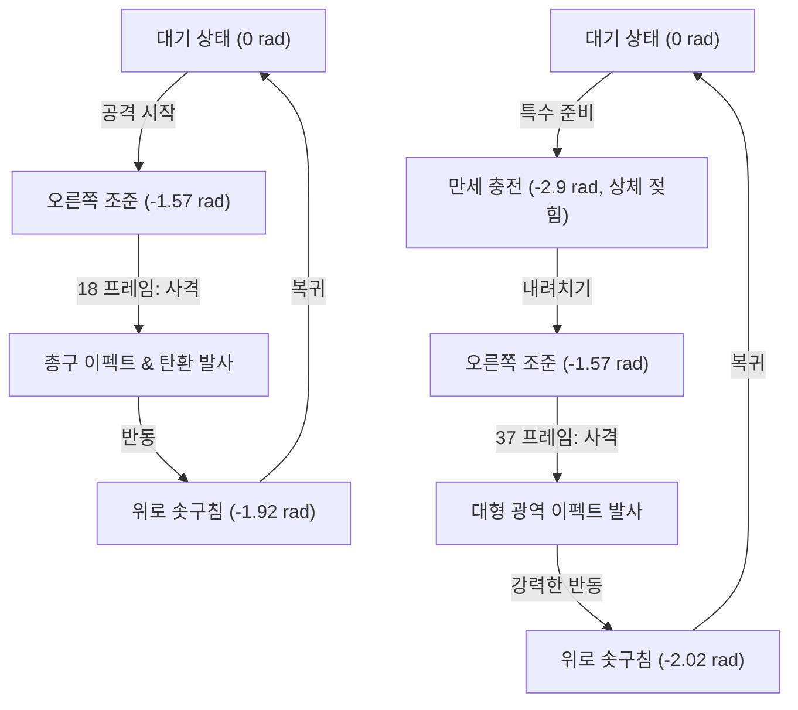

# 🧬 Spine 2D Skeletal Rig Animation Update Specifications

본 문서는 **Spine 2D 관절 리깅 및 스킨 스와핑 시뮬레이터(WebGL Skeletal Rig)**의 공격 및 특수 애니메이션 개선 사항과 시각 효과(Particle Emitter)에 대한 명세서입니다. 캐릭터가 오른쪽(앞쪽)을 바라보고 사격하는 특성을 바탕으로 모션과 반동 각도, 탄도를 전면 최적화했습니다.

---

## 1. ⚙️ 애니메이션 물리 개요
시뮬레이터 내에서 모든 각도 제어는 시계 방향(Clockwise)이 양수(+), **시계 반대 방향(Counter-Clockwise)이 음수(-)**인 PixiJS 좌표계를 기준합니다. 캐릭터가 오른쪽(앞)을 보고 있으므로:
* **오른쪽 정면 수평 조준**: 어깨 관절 `-1.57` rad (-90도)
* **머리 위 수직 만세**: 어깨 관절 `-2.9` rad ~ `-3.14` rad (약 -170도)
* **기본 대기 자세**: 어깨 관절 `0.0` rad (아래를 향함)



---

## 2. 🎬 애니메이션 상태 상세 명세

### 🔫 일반 공격: 사격 및 반동 (Attack)
일반 공격 시 왼손에 장착된 무기를 오른쪽 90도로 겨냥한 후 사격하고, 탄성에 의한 반동 후 대기 자세로 돌아옵니다.

| 구간 (Progress) | 동작 상태 | 왼팔 각도 (`lArmRot`) | 앞팔 각도 (`lForearm`) | 상체 각도 (`torsoRot`) | 무기 각도 (`weaponRot`) |
| :--- | :--- | :--- | :--- | :--- | :--- |
| **0 ~ 15** | 오른쪽 정면 90도 조준 선정렬 | `0` ➡️ `-1.57` rad | `0` ➡️ `0.1` rad | `0` ➡️ `0.04` rad | `0` ➡️ `-0.1` rad |
| **15 ~ 18** | 조준 유지 및 대기 | `-1.57` rad | `0.1` rad | `0.04` rad | `-0.1` rad |
| **18** | **총구 화염 및 탄환 오른쪽 발사** | `-1.57` rad | `0.1` rad | `0.04` rad | `-0.1` rad |
| **18 ~ 23** | **사격 반동 (팔 위로 솟구침)** | `-1.57` ➡️ `-1.92` rad | `0.1` ➡️ `-0.05` rad | `0.04` ➡️ `-0.04` rad | `-0.1` ➡️ `-0.4` rad |
| **23 ~ 28** | 반동 회복 및 조준 복원 | `-1.92` ➡️ `-1.57` rad | `-0.05` ➡️ `0.1` rad | `-0.04` ➡️ `0.04` rad | `-0.4` ➡️ `-0.1` rad |
| **28 ~ 48** | 대기 상태로 느린 복귀 | `-1.57` ➡️ `0` rad | `0.1` ➡️ `0` rad | `0.04` ➡️ `0` rad | `-0.1` ➡️ `0` rad |

> [!NOTE]
> 사격 시 반동 효과를 살리기 위해 어깨 관절 외에도 상체(`torsoRot`)가 왼쪽(뒤)으로 살짝 젖혀지고 머리(`headRot`)가 뒤로 밀리는 상호작용 물리 궤적이 결합되었습니다.

---

### ⚡ 특수 공격: 만세 충전 후 정면 내려 쏘기 (Special)
양손을 머리 위로 완전히 쭉 뻗어 힘을 모은 뒤, 오른쪽 정면으로 강하게 내리치며 대형 사격을 가합니다.

| 구간 (Progress) | 동작 상태 | 왼팔/오른팔 각도 (`lArmRot` / `rArmRot`) | 앞팔 각도 (`lForearm` / `rForearm`) | 상체 각도 (`torsoRot`) | 무기 각도 (`weaponRot`) |
| :--- | :--- | :--- | :--- | :--- | :--- |
| **0 ~ 25** | **만세 준비 (팔을 머리 위로 완전히 뻗음)** | `0` ➡️ `-2.9` / `-2.7` rad | `0` ➡️ `-0.1` rad (곧게 편 상태) | `0` ➡️ `-0.18` rad (크게 젖힘) | `0` ➡️ `-1.2` rad (하늘 조준) |
| **25 ~ 37** | **정면 내려치기 및 수평 조준 완료** | `-2.9` / `-2.7` ➡️ `-1.57` rad | `-0.1` ➡️ `0.1` rad | `-0.18` ➡️ `0.1` rad | `-1.2` ➡️ `-0.1` rad |
| **37** | **대형 특수 사격 발사 (파티클 버스트)** | `-1.57` rad | `0.1` rad | `0.1` rad | `-0.1` rad |
| **37 ~ 43** | **특수 사격 강력 반동 (상체 뒤로 밀림)** | `-1.57` ➡️ `-2.02` rad | `0.1` ➡️ `0.0` rad | `0.1` ➡️ `-0.15` rad (강하게 젖힘) | `-0.1` ➡️ `-0.7` rad |
| **43 ~ 49** | 반동 회복 및 조준선 복원 | `-2.02` ➡️ `-1.57` rad | `0` ➡️ `0.1` rad | `-0.15` ➡️ `-0.05` rad | `-0.7` ➡️ `-0.1` rad |
| **49 ~ 75** | 대기 자세로 복귀 | `-1.57` ➡️ `0` rad | `0.1` ➡️ `0` rad | `-0.05` ➡️ `0` rad | `-0.1` ➡️ `0` rad |

> [!TIP]
> 만세 자세(0~25 구간)에서 팔꿈치 각도를 살짝 마이너스(`-0.1`)로 펴주어, 팔이 꺾이지 않고 머리 위로 쭉 뻗는 만세 자세의 선이 가장 미려하게 표현되도록 개선했습니다.

---

## 3. 💥 무기별 특화 파티클 시스템 ([spawnSkeletalShootEffect](file:///D:/workspace/newfolder/test.html#L2326-L2488))
장착된 무기의 성격에 맞게 파티클 이미터가 실시간으로 변경되어 투사체를 생성하고 오른쪽 정면으로 뿜어냅니다.

```carousel
```javascript
// 1. 정신 파동 링 (Mind Blaster) 이펙트
// - 오른쪽으로 발사되는 시안색 고속 플라스마 에너지 탄환 (vx = 15+)
// - 발사 시 총구 주변에 마젠타/시안 컬러의 파동 링 (Scale 증가, Alpha 페이드)
// - 전방으로 뿜어지는 원형 플라스마 스파크
```
<!-- slide -->
```javascript
// 2. 키메라 요술봉 (Scrap Wand) 이펙트
// - 오른쪽으로 발사되는 크고 귀여운 분홍색 마법 탄환 (vx = 10+)
// - 사방으로 화려하게 회전하며 흩뿌려지는 골드/핑크 별빛 파티클
```
<!-- slide -->
```javascript
// 3. 땅콩 주머니 (Peanut Bag) 이펙트
// - 여러 갈래로 뿜어져 나가는 갈색/노란색 땅콩 알갱이 투사체들 (vx = 11+)
// - 날아가는 각도에 맞추어 타원이 회전(rotation)하며 땅콩가루 더스트 분사
```
```

---

## 4. 🔗 수정된 파일 및 기여 항목
* **관절 물리 시뮬레이터**: [test.html](file:///D:/workspace/newfolder/test.html)
  * [spawnSkeletalShootEffect](file:///D:/workspace/newfolder/test.html#L2326-L2488) - 사격 파티클 이펙트 이미터 로직
  * [attack 모션 핸들러](file:///D:/workspace/newfolder/test.html#L2611-L2674) - 일반 공격 오른쪽 반동 및 궤적 조절
  * [special 모션 핸들러](file:///D:/workspace/newfolder/test.html#L2675-L2738) - 특수 만세 충전 및 내리쳐 쏘기 궤적 조절
